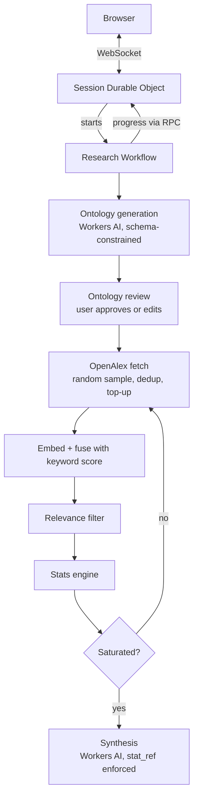

# Research Trends

An agent that answers research-trend questions ("what research is being done in the AI x Cybersecurity space?") by gathering evidence from a scholarly source using strict statically backed guardrails until it has enough to say something, then reporting its own coverage and confidence instead of asserting a number it can't back up.

Built entirely on Cloudflare's developer platform: Workers, Durable Objects, Workflows, and Workers AI.

> **Status: early-stage, in active development.** The session layer, OpenAlex fetching, and ontology generation work. The statistics, retrieval filtering, and synthesis layers have been designed but not built yet. The [status table](#status) is exact about what is and isn't done.

## Contents

- [The core idea](#the-core-idea)
- [Architecture](#architecture)
- [Design decisions](#design-decisions)
- [Status](#status)
- [Roadmap](#roadmap)
- [Running it locally](#running-it-locally)
- [Layout](#layout)

## The core idea

An LLM is only used where language judgment is the actual task. Every consequential number is computed by deterministic code.

| The model decides                                              | Code decides                                                  |
| -------------------------------------------------------------- | ------------------------------------------------------------- |
| Expanding a topic into synonyms, methods, and topic boundaries | Which papers count as relevant (a threshold on a fused score) |
| Turning computed statistics into prose                         | When to stop retrieving (saturation and estimate stability)   |
|                                                                | Confidence intervals, coverage, significance                  |

The model never sees a number it could invent. The planned synthesis step requires every numeric claim to cite a specific stats-engine object (`stat_ref`), and a validator strips anything that doesn't trace back to one.

## Architecture



| Cloudflare product  | Role                                                                                                                   |
| ------------------- | ---------------------------------------------------------------------------------------------------------------------- |
| **Workers**         | Stateless entrypoint that routes each connection to its session                                                        |
| **Durable Objects** | One per session. Holds the hibernating WebSocket and relays progress updates from the Workflow over RPC                |
| **Workflows**       | Orchestrates the retrieval loop. Steps are durable and retryable, so a rate-limited OpenAlex call doesn't lose the run |
| **Workers AI**      | Ontology generation now; embeddings and synthesis planned                                                              |

## Design decisions

- **Saturation over a fixed sample size.** An early version computed a Cochran sample size up front. I dropped it: a population-based number says nothing about whether the evidence gathered is actually stable. Retrieval will instead continue until new batches stop adding new relevant papers and the tracked estimate stops moving.
- **Random sampling, not first-page results.** OpenAlex returns results in a fixed order, so taking the first N over-represents whatever it ranks first. The adapter uses its `sample` parameter for a true random draw, with no fixed seed so each batch is independent.
- **Multi-topic queries are AND-combined clusters.** A flat list of synonyms can't represent "AI applied to cybersecurity" without losing the relationship between the two topics. Terms within a cluster are OR-ed, and clusters are AND-ed.
- **The user reviews the ontology before retrieval starts.** Ontology generation is the one non-deterministic step with no formula checking it. Prompt tuning reduced errors like misfiled synonyms but couldn't eliminate them, so the plan is a deterministic duplicate-term check, then a review step where the user edits the structured object directly.
- **In-memory cosine similarity, not Vectorize.** Single-source, single-session candidate volume is small enough that a persistent vector index isn't worth its complexity.

## Status

| Component                                                                                 | Status                     |
| ----------------------------------------------------------------------------------------- | -------------------------- |
| Session Durable Object (hibernating WebSocket, RPC progress push)                         | Done                       |
| OpenAlex adapter (random sample, abstract filtering, duplicate-title dedup, top-up retry) | Done                       |
| Demo client (`research-trends-client.html`)                                               | Done                       |
| Ontology generation (multi-cluster, schema-constrained)                                   | Working, still being tuned |
| Deterministic duplicate-term check                                                        | In progress                |
| Ontology review checkpoint                                                                | In progress                |
| Ontology-to-query expansion                                                               | In progress                |
| Hybrid retrieval (embeddings + keyword fusion)                                            | Planned                    |
| Relevance filter and saturation-based stopping                                            | Planned                    |
| D1 storage (papers, coverage log)                                                         | Planned                    |
| Stats engine (Wilson interval, coverage, Shannon diversity, Benjamini-Hochberg)           | Planned                    |
| Synthesis with `stat_ref` enforcement and a causal-language guardrail                     | Planned                    |

## Roadmap

**Next:** finish the ontology stage (duplicate check, review, query expansion), then hybrid retrieval.

**After that:** relevance filter, saturation-based stopping, D1, stats engine, synthesis.

**Deliberately out of scope for the MVP** (written down so they aren't assumed handled):

- Time-over-time trend comparison
- Cross-topic overlap analysis (two independent evidence sets plus a comparison metric)
- A clarification turn for ambiguous queries (e.g. a bare "RAG")
- Multi-source retrieval
- Exposing each analysis as an MCP tool so an external agent can route questions, and answer follow-ups like "where did this come from" or "give me the paper list" using data this system already logs

## Running it locally

```bash
cd cf-worker-mvp
npm install
npx wrangler login    # Workers AI needs a Cloudflare account
npx wrangler dev
```

Open `cf-worker-mvp/src/research-trends-client.html` in a browser and submit a query. It connects to `ws://127.0.0.1:8787` by default. To point it elsewhere, edit the `WORKER_WS_URL` constant near the top of the file.

The pipeline currently stops after ontology generation: you'll see the generated ontology come back as JSON. The OpenAlex batch loop is written but disabled in `workflow.ts` until the ontology stage is finished.

## Layout

```
cf-worker-mvp/
  src/
    index.ts                     Worker entrypoint, routes each request to its session DO
    session.ts                   Session Durable Object (WebSocket + progress relay)
    workflow.ts                  Research Workflow (orchestrates the pipeline)
    generateOntologyObject.ts    Schema-constrained ontology generation (Workers AI)
    sources/openalex.ts          OpenAlex adapter (random sample, dedup, top-up)
    methodologyGuard.ts          Superseded Cochran sample-size approach, kept for reference
    research-trends-client.html  Single-file demo client
  test/index.spec.ts             Vitest tests (Workers pool)
  wrangler.jsonc                 Bindings: Durable Object, Workflow, Workers AI
  learnings.md                   What I learned building this
```
